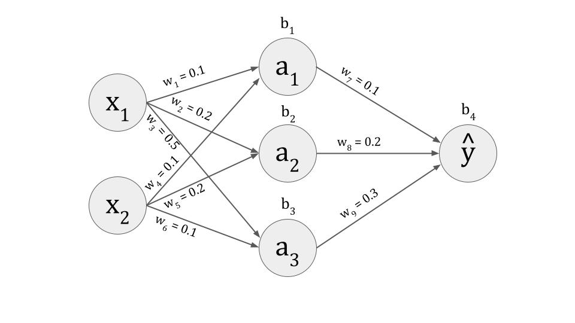

# NeuralFoundry

## Overview
A handcrafted neural network engine built from scratch.

Why would anyone ever do this? They wouldn't. It's just for experimentation and learning more about how the underlying machine learning works.

## How it works

The neural network is initialized with two input nodes, three nodes in the hidden layer, and one output node. The program starts by initializing weights and biases for each node in the network, then it performs a forward pass where it calculates the loss, which tells us how far the network’s prediction is from the true target. After that, the network performs back propagation to adjust the weights and biases to reduce loss for the next iteration. This process repeats for the number of epochs set, and uses randomly generated values between 0 and 100 for the two input nodes.

## Project structure
neuralfoundry/
├── app/
│   ├── __init__.py        # makes `app` a Python package
│   ├── neural_network.py  # neural network class
│   ├── activations.py     # activation functions and derivatives
│   └── main.py            # entry point / experiment script
└── README.md              # this file
└── neural_net_diagram.jpg # diagram of the neural network and initial weights and biases